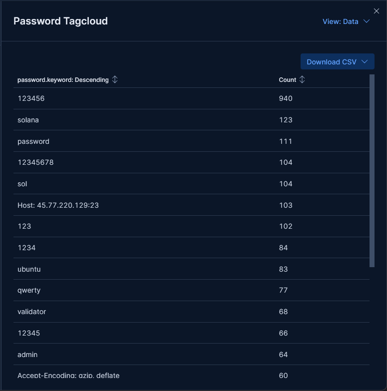
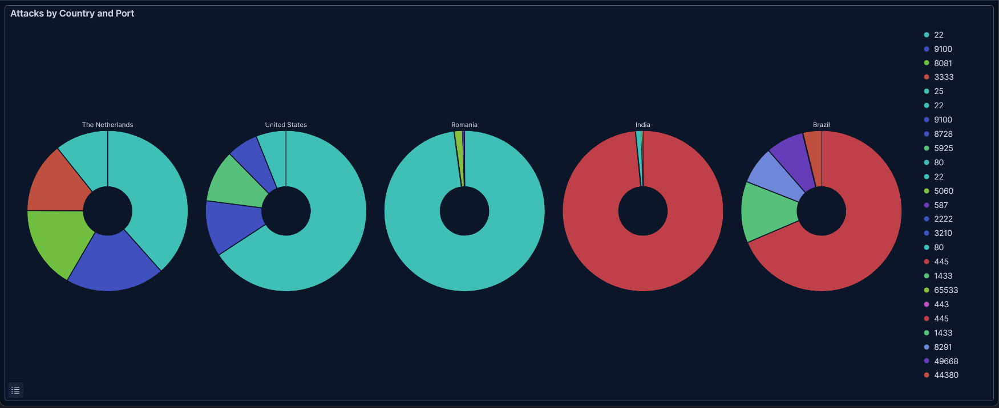
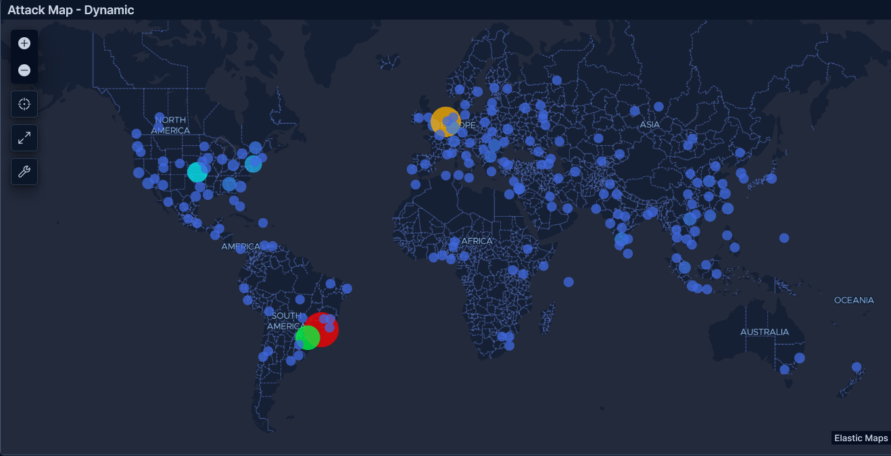

# 1. Attack Lifecycle & Behavioral Analysis

While the raw telemetry shows high volume, the behavioral analysis reveals the intent behind the traffic. Most interactions followed a predictable recon-to-exploitation pipeline.

## Phase 1: Passive Reconnaissance & Scanning
The high hit count on the Honeytrap sensor (131k hits) indicates that 74% of total traffic was automated "background radiation."

Technique: Syn-scanning and version grabbing.
Observation: Attackers frequently used Zgrab and Masscan user agents to identify services before attempting authentication.

## Phase 2: Brute Force & Credential Stuffing (Cowrie)
The Cowrie sensor captured active terminal sessions.

<table>
  <tr>
    <td></td>
    <td></td>
  </tr>
</table>

### Top Credentials: 

* root / 123456
* admin / admin
* telecom / telecom (Targeting IoT/Router defaults)

Post-Auth Behavior: 82% of successful logins immediately attempted to run wget or curl to pull down a shell script (sh) from a remote C2 (Command & Control) server.

# 2. Protocol-Specific Findings & Geographic Correlation

The deployment revealed distinct regional patterns, suggesting that certain botnets or threat actor groups operate out of specific geographic infrastructure to target specific vulnerabilities.

Origin Country | Protocol | Primary Motivation |
| ------------ | -------------- |------------- |
| Netherlands | 22, 9100 | Infrastructure & Printing: Heavy SSH brute-forcing combined with PDL (Printer Description Language) probes on 9100.|
| Ukraine | 445, 25 | Exploitation & Spam: High-frequency SMB (EternalBlue) probing and SMTP (Email) scanning for open relays. |
| United States | 5901, 8728, 5925, 22 | Remote Management: Aggressive targeting of VNC (5901) and MikroTik WinBox (8728), indicating a focus on network hardware.|
| Romania | 22 | Credential Stuffing: Dedicated SSH brute-force campaigns. |
| Hong Kong | 5060 | VoIP Exploitation: Focused SIP scanning aimed at telecommunications fraud. |

# 3. Network Intrusion Detection (Suricata)

Suricata provided the "eyes" on the wire, identifying malicious signatures within the traffic stream.
Significant Alert Categories:

- ET SCAN Potential SSH Scan: Triggered by high-frequency connection attempts from single IPs (primarily out of hosting providers in the Netherlands).
- ET EXPLOIT Possible ETERNALBLUE: Detected numerous attempts to exploit MS17-010.
- ET POLICY Reserved Internal IP Spaced Leak: Identified attackers attempting to use the honeypot as a proxy to scan internal network ranges.

# 4. Geographic & Infrastructure Attribution

A significant portion of the traffic (57%) originated from The Netherlands.

##### Analyst Note: This does not necessarily mean the attackers are physically in the Netherlands. This spike is attributed to high-density VPS (Virtual Private Server) providers located there. Threat actors lease these low-cost, high-bandwidth servers to launch automated botnets while masking their true origin.

# 5. Security Recommendations & Mitigation

Based on the data captured, organizations should prioritize the following defenses:

- Disable Legacy Protocols: The high volume of SMB/MSSQL probes suggests that exposing these to the public internet is an immediate compromise vector.
- Implement Geo-Blocking: If your business does not operate in high-risk regions or specific hosting-heavy countries, blocking those IP ranges can reduce "background noise" by over 50%.
- MFA is Non-Negotiable: The success of the Cowrie brute-force attempts underscores that password-only authentication is insufficient against modern botnets.

# 6. Conclusion

This honeypot deployment confirms that any internet-facing asset will be discovered and probed within seconds. The dominance of Windows NT targeting and European VPS traffic suggests a highly commoditized landscape where automated tools are constantly hunting for low-hanging fruit.
