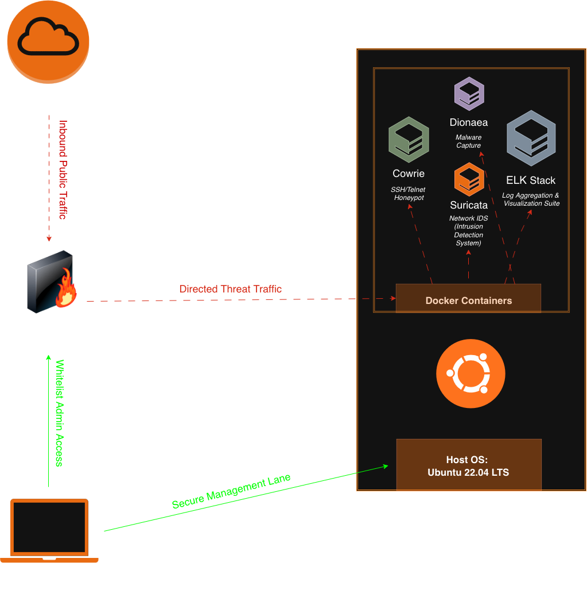
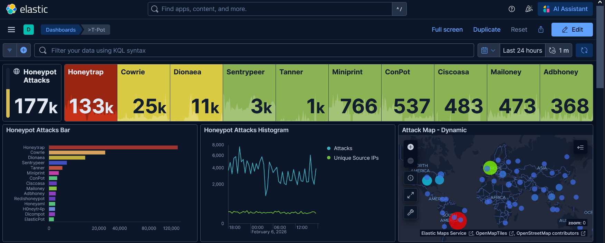
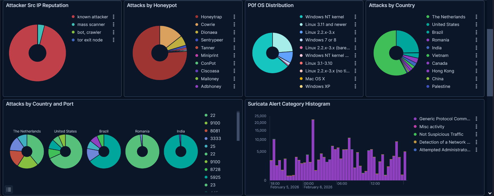

# Threat Intelligence Honeypot
## Project Overview
A containerized honeypot deployment hosted on Vultr using Ubuntu server. This project demonstrates the orchestration of multiple security sensors to capture, analyze, and visualize global threat actor behavior in real-time.
## System Architecture

## Technical Implementation Details

| Component | Specification |
| ------------- | ------------- |
| Cloud Provider  | Vultr (High-Performance Compute) |
| Host  | Ubuntu 22.04 LTS  |
| Container Engine | Docker & Docker Compose |
| Firewall | Vultr Stateless Network Firewall |
| Analytics | ELK Stack (Elasticsearch, Logstash, Kibana) |

## Security & OPSEC Posture
To maintain a secure posture and protect the underlying infrastructure, the following controls were implemented:
- Default-Deny Firewall: All ports are closed by default. Only specific honeypot "bait" ports are open to the public.
- Administrative Whitelisting: Management interfaces (SSH, Kibana) are strictly restricted to a single authorized source IP, making them invisible to unauthorized scanners.
- Container Isolation: All honeypot services (Cowrie, Dionaea, etc.) run in isolated Docker containers, preventing attackers from interacting with the Ubuntu host system.
- Data Anonymization: In compliance with security best practices, all Network Layer identifiers (IPs) haven been abstracted in this documentation to focus on behavioral threat patterns.

## Honeypot Sensor Catalog
- Cowrie (SSH/Telnet): Captured brute-force attempts and logged attacker command.
- Dionaea: Intercepted network-wide malware propagation attempts (SMB/MSSQL).
- Suricata: Provided signature-based Intrustion Detection (IDS) for all incoming traffic.

## Executive Summary: Threat Intelligence Findings

Over the course of the deployment, the sensors captured 175,000+ total attacks, revealing a high-intensity environment of automated scanning and exploitation attempts.
| Metric | Findings	| Key Insight |
| ------------- | ------------- | ------------- |
Total Telemetry	| 177,000+ Attacks	| Average of ~2 hits per second across all containers.
| Top Country| Netherlands (57%)|	Significant traffic from European-based VPS/Hosting providers.
| Primary OS	| Windows NT (64%)| Attackers are heavily prioritizing SMB/RDP vulnerabilities.
| Top Sensor	| Honeytrap (131k)| Captures the "background radiation" of port-scanning botnets.

    Note: For a comprehensive technical deep dive into the Suricata alerts, protocol fuzzing, and specific malware delivery patterns, please refer to the Technical Analysis Report (analysis.md).
